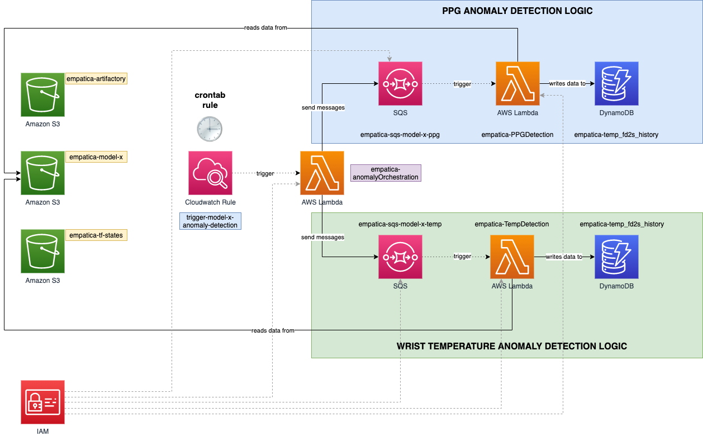

# FD2S (Faulty Devices Detection System)

## Data understanding

Before lowering my head and writing even one single line of code, an essential step is to understand the data I'm working with.
Developing a fault detection system without knowking the nature of data could be quite challenging.

Each device is sending across 3 kinds of signals:

- A photoplethysmogram (PPG) signal
- A wrist temperature signal
- A detection of on-wrist signal

| Signal name | Description                                                                        | Frequency - Period         | Note                           |
| ----------- | ---------------------------------------------------------------------------------- | -------------------------- | ------------------------------ |
| PPG         | Signal about variations of blood volume changes in the microvascular bed of tissue | 64Hz - 1 sample per 0.016s |                                |
| Wrist Temp  | Temperature detected on the wrist in cents of °C                                   | 4Hz - 1 sample per 0.25s   |                                |
| On-wrist    | Detection whether the devices is worn or not                                       | 1Hz - 1 sample per second  | This values are always correct |

## EDA

docker run -it -v /Users/alessandro.negrini/Personal/fd2s/:/home/jovyan/work --rm -p 8888:8888 jupyter/pyspark-notebook

## Solution Architecture

This is the cloud architecture I have thought to be one of the best one, considering the problem constraints. 
 

### Solution frequency computation

### How does the solution scale?

### Solution limits 

