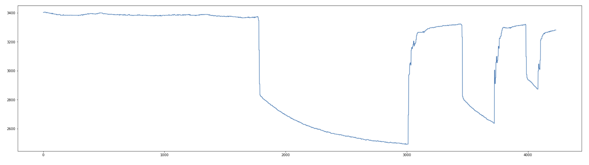
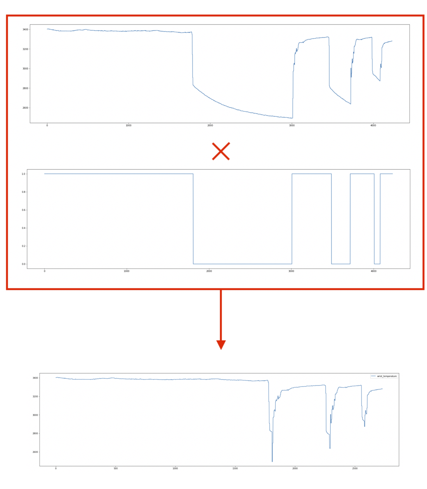
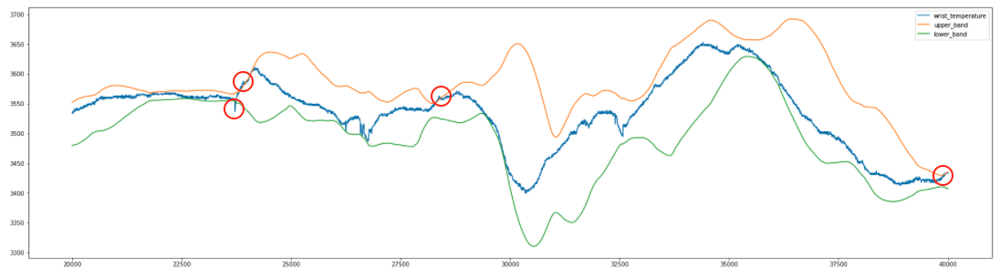
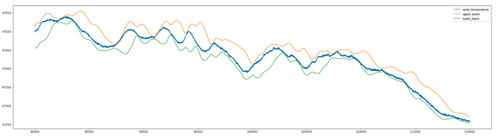
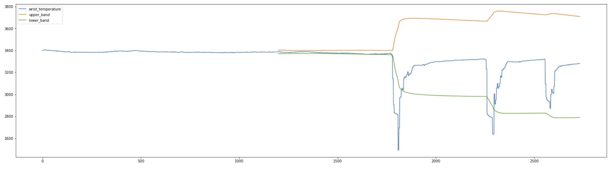
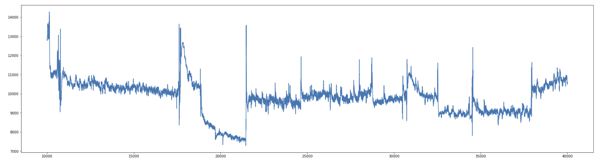

# Exploration Data Analysis

Before lowering my head and writing even one single line of code, an essential step is to understand the data I'm working with.
Developing a fault detection system without knowking the nature of data could be quite challenging.

Each device is sending across 3 kinds of signals:

- A photoplethysmogram (PPG) signal
- A wrist temperature signal
- A detection of on-wrist signal

| Signal name | Description                                                                        | Frequency - Period         | Note                           |
| ----------- | ---------------------------------------------------------------------------------- | -------------------------- | ------------------------------ |
| PPG         | Signal about variations of blood volume changes in the microvascular bed of tissue | 64Hz - 1 sample per 0.016s |                                |
| Wrist Temp  | Temperature detected on the wrist in cents of °C                                   | 4Hz - 1 sample per 0.25s   |                                |
| On-wrist    | Detection whether the devices is worn or not                                       | 1Hz - 1 sample per second  | This values are always correct |


Before starting expliciting the algorithmic choices I went for, I'd like to male a small premise:
* I don't have any medical knowledge, therefore during the development I did a few assumptions (further details below). 
I apologize for any assumptions that do not have any medical truth
* I have rarely dealt with time series. I am pretty sure there are libraries that allows to achieve the same behaviour
in a more optimized way. I used `pandas` and I dealt signals as `pandas Series` and `Dataframes`. 

## Algorithmic/Infrastructure choices
Here below you can find a few assumptions/choices I did before starting working: 
* the `temperature_wrist` and `ppg` signals have been treated as independent ones: I assumed there is
no correlation between the two signals
* since the amount of data we are dealing with is not big at all, I avoided to use any Big Data framework (e.g. `Spark`).
All the devices are treated as independent entities
* `python3.8` will be used to code the faulty detection solution

### Faulty device detection regarding the WRIST TEMPERATURE signal
The body temperature is a common metric, that anybody knows. 
Devices log this metric in `cents of Celsius`, therefore a value of `3600` corresponds to `36°`.

The human temperature range should be in the range 32°C-36°C (3200-3600).

To make everything trickier there is the fact that a device can be worn or not. 
When the device is not worn, it keeps logging temperature (probably the environment one(my assumption)).

As an example, here below two graphs showing the `wrist temperature` and the `on_wrist` signal. The latter is 1 when the device in worn, 
0 otherwise. 



 
As you may note, rightly after worning the device, there is a transition time to reach to get up to speed.

Goal of the task is to find the faulty detection devices and here you can have a look on the algorithm implemented.

### Faulty detection algorithm
* The two signals (`on_wrist` and `wrist_temperature`) have two different frequencies, respectively 1Hz and 4Hz. 
Therefore, after reading them I brought the `on_wrist` signal to 1Hz to 4Hz.
* Since I'd like to analyse the temperature signal only when the device in worn (in this way I am analysing the signal in 
a controlled environment (the human body)), I multiply the signals and delete the samples at 0.  
This way the signal I am working with, will show only the body temperature metrics

    

* Once removed "dirty" samples, we can proceed with the evaluation of a few statistics metrics that allowed me to
spot which are faulty devices:
  * **volatility index**: as far as I know the body temperature is not subject to big variation in a certain interval of
  time. The statistical approach I used is inspired to a technique it is frequently used in automated trading systems to measure 
  the index volatility: the Bollinger Bands.
  This method is also widely used to manufacturing data to detect defects (anomalies) in patterned fabrics. 
  In this context, I made use of this method to provide a relative definition of unusual variations of the temperature detected. 
  The first step in calculating this Band is to compute the simple `moving average` (in chose 1200 samples as window, that corresponds to
  5 minutes). 
  Next, on the same window size, we evaluate the `moving standard deviation` that measures how spread out numbers are from an average value. 
  Finally, multiply that standard deviation value by factor (in my case I choose 3) and both add and subtract that amount from each point along the SMA. 
  Those produce the upper and lower bands.
  
    ```
    LOWER_BAND = roll_avg + k * roll_std
    UPPER_BAND = roll_avg - k * roll_std 
    ```
  
     What described so far is illustrated in the graph below:
        
     The volatility index is finally computed by summing the deviation of the beyond samples, and dividing it by the number
     of the "outside" samples. 

     The higher this indicator is, the more likely the device is to be faulty. If the volatility_index is greater than 50, 
     the device could be faulty. 
  * **Average value**: the method just described is able to spot faulty devices only if the logged metrics are not stable.
  Consider the case when the device logs quite constants extreme high (or low) values: it won't work.    
  I decided to enrich the algorithm by evaluating the overall temperature average. Device is considered faulty if the average 
  stays outside the range 32°-43° 
  
    The average value in this case is around 47431 (474.31°C), and it is of course an anomaly. 
    
 
  * **Max value**: sometimes faulty devices have some spikes (eventhough the average is in the range). To detect spikes,
  I simply evaluated the overall max value and checked if is beyond the upper band (43°C).
  
  Each metric is saved to the DynamoDB, with the indication whether it is an anomal value or not. 
 
  
According to this logic the failure detected devices are: 
- `device_005` on day `2021/02/02` (anomaly on too low avg value)
- `device_006` on day `2021/02/04` (anomaly on too low avg value)
- `device_007` on day `2021/02/04` (anomaly on too high avg value, too high max value and too high volatility index)
- `device_012` on day `2021/02/02` (anomaly on too high volatility index)
- `device_016` on day `2021/02/02` (anomaly on too low avg value)
- `device_019` on day `2021/02/03` (anomaly on too low avg value)

#### False positives and solution improvement
Once the automatic solution spot the candidate failures, I checked them one by one.
And I probably found a false positive: `device_012`.
The device is said to be failured since it has been detected a volatility to high (as shown in the picture below).



What it makes the algorithm not working for this specific device is that around the
`off_wrist` event, it detects an abnormal temperature fluctuation, that is probably due to
the transition time taken from the device to get up to speed.
To fix it, what can be done is not only to delete samples of signals when the device is not worn, but also
in a interval slightly before and after. 

### Faulty device detection regarding the PPG signal
Unlike from the temperature signal, the problem didn't state the measure unit of the PPG metric. 
I did a few online searches, but without any success. 

Since I wasn't able to find online how such a device is expected to work (both in terms on measure units and on 
values ranges) I decided to completely entrust on signal analysis to spot a few statiscal metrics: 
- signal min value
- signal avg value
- signal max value

The high variability of the signal, didn't me allow to replicate the same approach applied for evaluating the 
temperature volatility. 
As you may see here, the metrics have significative fluctuations near each other: the signal is not smooth as the
wrist temperature one. 



### Faulty detection algorithm
* The two signals (`on_wrist` and `wrist_temperature`) have two different frequencies, respectively 1Hz and 64Hz. 
Therefore, after reading them I brought them at the same frequency:
 - `on_wrist` signal to 1Hz to 4Hz
 - `wrist_temperature` sampled from 64Hz to 4Hz (statistics metrics does not have any impact)
* Since I'd like to analyse the PPG signal only when the device in worn (in this way I am analysing the signal in 
a controlled environment (the human body)), I multiply the signals and delete the samples at 0.  
This is the same approach used for the temperature.

* Once removed "dirty" samples, we can proceed with the evaluation of a few statistics metrics that allowed me to
spot which are faulty devices:
    * **avg value**:
    from a analysis done on all the signals I noted that the avg value reached by most of the devices lays
    in the range `5000` and `11000`. An anomaly is triggered when the value goes outside this range. 
    * **max value**:
    from a analysis done on all the signals I noted that the max value reached by most of the devices is around 20k.
    I therefore implemented a rule that is alerting if the maximum value detected by the device is not between 
    `19000` and `21000`
    * **min value**:
    from a analysis done on all the signals I noted that the lowest value reached by most of the devices lays
    in the range `1000` and `6000`. An anomaly is triggered when the value goes outside this range.
    
I'd like to emphatize that those ranges have been found in an empirical way, and may do not reflect
any medical truth. 

According to this logic the failure detected devices are: 
- `device_005` on day `2021/02/02` (anomaly on too high avg and min value)
- `device_006` on day `2021/02/04` (anomaly on too low avg, min, max values)
- `device_007` on day `2021/02/04` (anomaly on too high avg, min and max values)
- `device_016` on day `2021/02/02` (anomaly on too low avg value, min and max values)
- `device_019` on day `2021/02/02` (anomaly on too low max value)

### Faulty devices
Apart from the false negative mentioned above, the devices logging an anomalous signals are the same both from temperature
and PPG, and they are: 

- `device_005` on day `2021/02/02`
- `device_006` on day `2021/02/04`
- `device_007` on day `2021/02/04`
- `device_016` on day `2021/02/02`
- `device_019` on day `2021/02/02`


## Run Jupyter notebooks 

#### Requirements
- Docker

Before the solution industrialization, I used the Jupyter notebooks to prototype a possible solution and to plot time
 series. 
 
If you'd like to see them, just type:
```
docker run -it -v <PATH>:/home/jovyan/work --rm -p 8888:8888 jupyter/pyspark-notebook
``` 
\<PATH\> is the path where the fds2 project is saved, for example: `/Users/alessandro.negrini/Personal/fd2s/`

 
